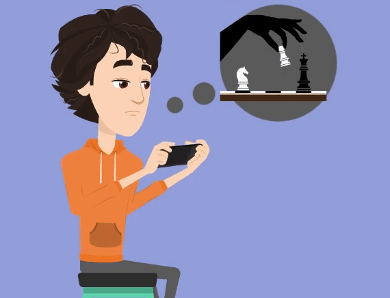
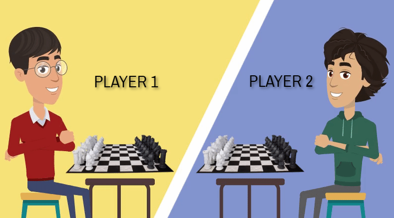
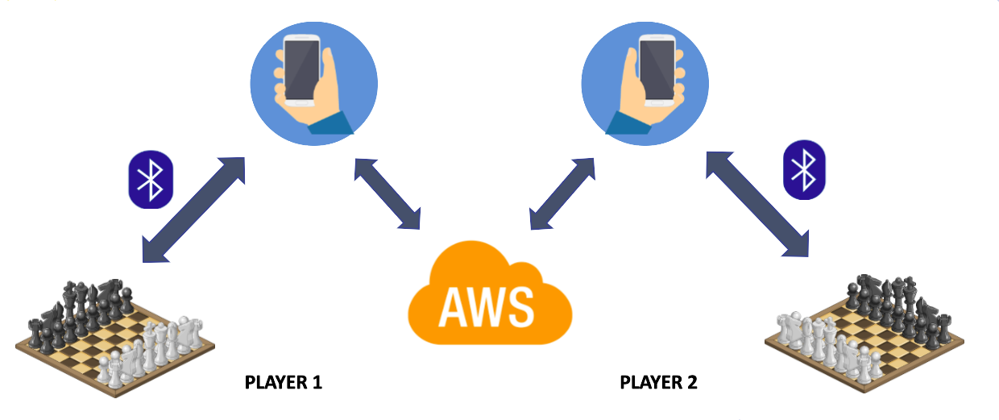

# chessMATE 
## Smart Chess Platform

### [Visit Our Website]( https://cepdnaclk.github.io/e16-3yp-chessMATE/)

### Group Members:
  - Isurika Adikari   : E/16/012 : e16012@eng.pdn.ac.lk
  - Damsy De Silva    : E/16/069 : e16069@eng.pdn.ac.lk
  - Chaminie De Silva : E/16/070 : e16070@eng.pdn.ac.lk

## Problem
  Chess is one of the most popular and oldest board games played by millions of people worldwide. But still there are some difficulties chess players face which limits them to enjoy this game to its fullest. 
  
  When chess players have trouble finding competent opponents in their locality, they try online chess on a mobile or desktop application. We found out that most of the professional as well as casual chess players are more likely to play chess game on a physical chess board rather than on a mobile or desktop screen. 

  
   Many chess players have stated that they have trouble in focusing and attacking aggressively during games played through mobile or desktop applications. And also, they have confessed that when playing using the physical chess board, they get to touch the pieces as they make a move, and this really draws them into the game.  
   
 ## Solution
 
 Our solution is an IOT platform which will provide the grand usual chess board experience to whom that need online chess. 
 
 
 
 ## About Product

### Vision of the Product:

   The vision of the chessMATE is to add a cool online chess game experience on everyday lives of people. Our endeavour is to give people more human experience with the new next generation technology. 

 

### Product Overview:

   Our product consists of two main sections; an electrically powered chess board (Smart chess board) and a mobile app. 

   In order to start a game, first you need to connect the board with the mobile app. Next you have to connect to an opponent who is registered on our platform via the mobile app. Then you can start the game.  

   When you make a move on your chess board, that move is sent to the chess board and mobile app of the opponent and the path of the move is displayed along with the start and end squares on the chess board owned by the opponent using the LEDs on the board. Then the opponent is required to manually place the specific chess piece moved by you on the correct end square in order to continue the game. 

   The main game mode we offer to our clients is the Board Vs Board game mode. Further the Board Vs App and App Vs App game modes can be experienced by the chessMATE clients. 

 
### High-Level Architecture

Given below diagram shows the high-level architecture of our solution. 

### Advising Lecturers
 - Dr. Isuru Nawinne
 - Dr. Ziyan Maraikar
 
### Links

- [Department of Computer Engineering](http://www.ce.pdn.ac.lk/)
- [Faculty of Engineering](http://eng.pdn.ac.lk/)
- [University of Peradeniya](https://www.pdn.ac.lk/)

